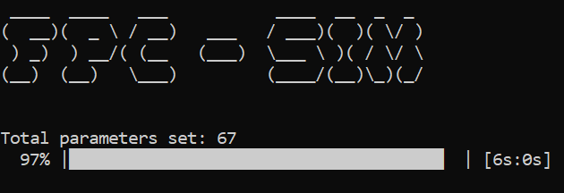

```
 ____  ____   ___           ____  __  _  _  
(  __)(  _ \ / __)   ___   / ___)(  )( \/ ) 
 ) _)  ) __/( (__   (___)  \___ \ )( / \/ \ 
(__)  (__)   \___)         (____/(__)\_)(_/ 
```

## The Fast Probabilistic Consensus simulator

Fast Probabilistic Consensus (FPC) is one of the proposed consensus algorithms in [Coordicide](https://coordicide.iota.org/) (the removal of the IOTA Coordinator).

In FPC, nodes vote on whether they like or dislike a transaction. This vote is represented by a 1 or 0. When all honest nodes reach the same voting opinion, consensus is reached.

In the simulation, nodes can be either honest or adverse. Honest nodes query the opinion of a random set of other nodes (defined in a `k` parameter) and set their own opinion to the majority opinion.

To simulate an attack on the protocol, you can set a strategy for the adversary nodes in the `Adv_Strategy` parameter.

Nodes vote in rounds. You can define the average opinion of the honest nodes (defined in the `p0` parameter) for the initial round. For example, if `p0=0.9`, the honest nodes will have a 90% majority of 1 opinions when the simulation starts. As a result consensus should be reached on the value 1. If `p0=0.2`, the honest nodes will have an 80% majority of 0. As a result, consensus should be reached on the value 0. 

For a given round each node calculates the average opinion of `k` randomly queried nodes and this value is denoted as *eta*. If eta is larger than the threshold, the opinion of that node is set 1, or 0 otherwise. The threshold is between `[a,b]` in the first round, and between `[beta,1-beta]` in the following rounds. For a given node the protocol terminates if the node has the same opinion for `l` (but at least `l`+`m`) consecutive rounds. Unless the round reaches round `maxTermRound`, for which the simulation stops with a termination failure.

To find out more details about FPC, read the following:

- ["The Fast Probabilistic Consensus simulator"](https://blog.iota.org/the-fast-probabilistic-consensus-simulator-d5963c558b6e) by Dr. Andreas Penzkofer
- ["Consensus in the IOTA Tangle - FPC"](https://blog.iota.org/consensus-in-the-iota-tangle-fpc-b98e0f1e8fa) by Dr. Sebastian Mueller
- ["FPC-BI: Fast Probabilistic Consensus within Byzantine Infrastructures"](https://arxiv.org/pdf/1905.10895.pdf) by Dr. Serguei Popov and Dr. William J. Buchanan  
- ["Simulations of the FPC"](http://datatreker.com/simulations-of-the-fast-probabilistic-consensus-protocol-fpc) by Dr. Sebastian Mueller   

## Motivation

This repository is where the IOTA Foundation's Research Team simulates tests on the FPC protocol to study attack strategies on different kinds of network topologies.

By making this repository open source, the goal is to allow you to keep up with the development status and learn more about how it works.

Feel free to do your own simulations by following the steps below.

## Prerequisites

[Install Go](https://golang.org/doc/install) if it is not already installed on your machine. It is recommended that you use the most recent version of Go.

## Step 1. Build and run the simulation

1. Clone the repository

    ```bash
    git clone https://github.com/iotaledger/res-sim-fpc.git
    ```

2. Build the executable file

    ```
    cd res-sim-fpc
    go build -o sim
    ```

    You can also use the `build` tool to cross-compile the binary files for other architectures.

3. If you want to change how the network behaves, edit the [parameters](#parameters) in the `input.txt` file

4. If you're using Windows, add the `.exe` file extension to the `sim` file

5. Run the simulation

    ```
    ./sim
    ```

Since we allow for vector inputs, i.e. multiple parameter settings, a progress bar is added to display the progress across the entire parameter space. When the progress bar reaches 100%, the simulator has finished for all parameter settings.



## Step 2. Examine the data

To analyse the results of the simulation, read the `.csv` files in the `data` directory:

- *AgreementRate*: Rate at which all honest nodes conclude with the same opinion 
- *IntegrityRate*: Rate at which all honest nodes conclude with the same opinion and the final opinion is the same as the original majority
- *TerminationRate*: Rate at which all honest nodes conclude before maxTermRound
- *MeanTerminationRound*: Average round when FPC terminated
- *MedianTerminationRound*: Median round when FPC terminated
- *TerminationRound*: How many rounds are necessary to complete FPC (Histogram)
- *MeanLastRound*: Mean last round across all nodes
- *LastRoundHisto*: Histogram of nodes' individual termination rounds
- *OnesProportion*: The proportion of 1s after the protocol terminates
- *OnesPropEvolution*: Evolution of the 1s proportion
- *EtaEvolution*: Histogram of honest eta's for each round

Now that you have data, you can run one of the Python scripts to visualize the data in a graph.

## Step 3. Visualize the data

To use the Python scripts, you must have Python and PIP installed. These scripts output `.eps` files, so to view the graphs, you need an application that can open them.

1. Install the dependencies

    ```bash
    pip install dash numpy matplotlib
    ```

2. For a single-vector-parameter input, edit the output setting in the `plot.py` file to read the correct csv column

    ```
    python plot.py
    ```
The script provides two figures:
- The termination, agreement, and integrity rate
- The mean last round for all nodes, as well as the mean round at which the protocol terminated

**Note:** The total message complexity in the network can be approximated by the mean last round times the quorum size k times the number of nodes.

   

3. For 2-vector-parameter inputs, edit the output setting in the ` file` to read your chosen csv columns

    ```
    python plot2D.py
    ```
The script provides plots with the termination, agreement, and integrity rate as a heat map of the input vectors. 

4. For a single-parameter input (no vector), enable the `enableSaveEta` parameter in the `input.txt` file and run:

    ```
    python plot_eps.py
    ```
In every round the number of non-finalized honest nodes are counted that have taken on a given eta value and the result is stored in a slice of histograms (`EtaEvolution`). This data is used to output a heatmap of the eta's evolution with time. 

## Parameters

These parameters affect how the simulated network behaves. As a result, changing these paramters has an affect on how long the network takes to reach a consensus.

A description and functionality of some of the parameters is provided in [the blog](need URL) that accompanies the release of this code.

To change any of these parameters, edit them in the `input.txt` file.

|   **Parameter**       |       **Type**    | **Description**    |
|-------------------|:-------------:|:--------------|    
|   `nRun`            |   int         | Number of runs for each simulation. Each run is a new voting object and it can be, for example, understood as a new transaction. |
|   `N`               |   int         | Number of nodes |
|   `a`               |   float64     | Lower threshold limit in the first round |
|   `deltaab`         |   float64     | Difference between a and and upper first threshold limit b  <br>[0.5 < a ≤ b < 1], [deltaab < 1-a ] |
|   `beta`            |   float64     | Threshold limits in the subsequent rounds [0 ≤ beta ≤ 0.5] |
|   `p0`              |   float64     | Proportion of nodes that have initial opinion 1, or 0 otherwise [0 ≤ p0 ≤ 1] |
|   `q`               |   float64     | Proportion of adversaries [0 ≤ q < 1] |
|   `k`               |   int         | Amount of nodes each node queries     |
|   `m`               |   int         | The cooling-off period |
|   `l`               |   int         | The required consecutive rounds for a node to finalize its opinion |
|   `maxTermRound`    |   int         | Maximum number of rounds before terminating the protocol |
|   `Adv_Strategy`    |   int      | Adversary strategy: `Adv_Strategy=1` is where adversary nodes always vote the opposite to whatever the value of the `p0` parameter is. `Adv_Strategy=2` is where adversary nodes vote with the minority opinion of the honest nodes from the previous round |
| `enableWS` | bool | Enable [Watts-Strogatz graph](https://blog.iota.org/the-fast-probabilistic-consensus-simulator-d5963c558b6e)|
| `deltaWS` | float64 | Watts-Strogatz parameter - Proportion of network that can be queried <br>[0 ≤ deltaWS < 1] |
| `gammaWS` | float64 | Watts-Strogatz paramter - Rewiring probability [0 ≤ gammaWS < 1] |
|   `rateRandomness`  |   float64     | Average rate at which a random number is created ([see this blog post for more details](https://blog.iota.org/the-fast-probabilistic-consensus-simulator-d5963c558b6e)) |
|   `etaAgreement`    |   float64     | Proportion of nodes ignored for agreement failure |
|   `enableSaveEta`         |   bool       | Save etas; this does not work if a vector input is provided |
| `enableExtremeBeta` |   bool        | Experimental: beta switches between min and max threshold |
| `enableRandN_adv` | bool | Turn nodes adversarial with probability q, otherwise assign by index |
